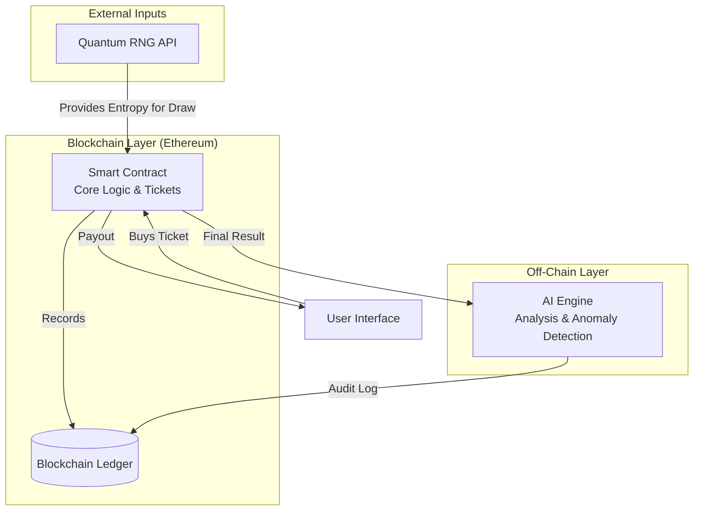

```markdown
# Quantum Lottery System 🔗🎲⚛️

[](https://opensource.org/licenses/Apache-2.0)

A revolutionary, provably-fair lottery system powered by Quantum Entanglement principles and Blockchain technology.

## 🌟 Features

*   **Provably Fair:** Leveraging quantum randomness for truly unpredictable results.
*   **Fully Transparent:** Every draw and transaction is recorded on the blockchain for public verification.
*   **Decentralized:** Operates via smart contracts, eliminating central points of failure and control.
*   **AI-Powered Analysis:** Utilizes machine learning for draw analysis, anomaly detection, and pattern monitoring.

## 🏗️ System Architecture (High-Level Overview)



## ⚙️ Installation & Local Development

### Prerequisites
- [Node.js](https://nodejs.org/) (v18 or higher)
- [Python](https://www.python.org/downloads/) (v3.10 or higher)
- [Hardhat](https://hardhat.org/) (for smart contract development)
- A basic understanding of Ethereum and smart contracts.

### Getting Started
1.  **Clone the repository:**
    ```bash
    git clone https://github.com/BlockchainLotteryAI/Quantum-Lottery-System.git
    cd Quantum-Lottery-System
    ```

2.  **Install dependencies:**
    *(This step will be updated once code is added)*
    ```bash
    npm install
    # or
    yarn install
    ```

3.  **Configure environment variables:**
    ```bash
    cp .env.example .env
    # Edit .env with your own keys (e.g., ALCHEMY_API_KEY, PRIVATE_KEY)
    ```

4.  **Run a local Hardhat network:**
    ```bash
    npx hardhat node
    ```

## 🧪 Usage

*How to interact with the system will be detailed here once the initial code is deployed.*

## 🛣️ Project Roadmap

- [ ] **Phase 1: Quantum RNG MVP** - Integrate with a quantum entropy source (Q4 2024).
- [ ] **Phase 2: Smart Contract Development** - Write and audit the core lottery logic (Q1 2025).
- [ ] **Phase 3: AI Integration & Testnet Launch** - Develop AI monitoring and launch on a public testnet (Q2 2025).
- [ ] **Phase 4: Mainnet Launch** - Final security audit and mainnet deployment (Q3 2025).

## 🤝 Contributing

We enthusiastically welcome contributions of all kinds. Please read our [Contributing Guidelines](CONTRIBUTING.md) for details on how to get started.

## 🛡️ Security

Please review our [Security Policy](SECURITY.md) for instructions on responsibly reporting security vulnerabilities.

## 📜 License

This project is licensed under the Apache License 2.0. See the [LICENSE](LICENSE) file for full details.

## ❓ Frequently Asked Questions

**Q: How is this different from a traditional blockchain lottery?**
A: Traditional systems use pseudo-random number generators (PRNGs). Our system aims to integrate verifiable quantum entropy sources, making the randomness fundamentally unpredictable and auditable.

**Q: Is the AI component centralized?**
A: The AI for analysis and monitoring may initially run off-chain for efficiency, but the core draw mechanism remains on-chain and decentralized. Results and audit logs will be committed to the blockchain.
```


**Commit this change** with a message like `"docs: complete repository README with architecture and roadmap"`.

---

### Step 3: Add Repository Topics

Topics make your project discoverable.

**Action:**
1.  Go to your repository's main page.
2.  Click on the **"About"** section on the right.
3.  Click the gear icon ⚙️ to edit.
4.  In the "Topics" field, add these keywords (type each one and press comma or space):
    `blockchain`, `quantum`, `lottery`, `ai`, `web3`, `solidity`, `random-number-generator`, `ethereum`, `smart-contracts`
5.  Click **Save changes**.

---

### Next Steps Preview

After you complete these three steps, your repo will look **1000% more professional**. Then we can move on to:
*   **Creating a `dev` branch** for active development.
*   **Adding a simple code structure** (e.g., a basic Hardhat project structure).
*   **Setting up GitHub Actions** for basic linting.
*   **Enabling Branch Protection** for the `main` branch.

Let me know when you have completed these steps, and we will proceed to the next phase.
