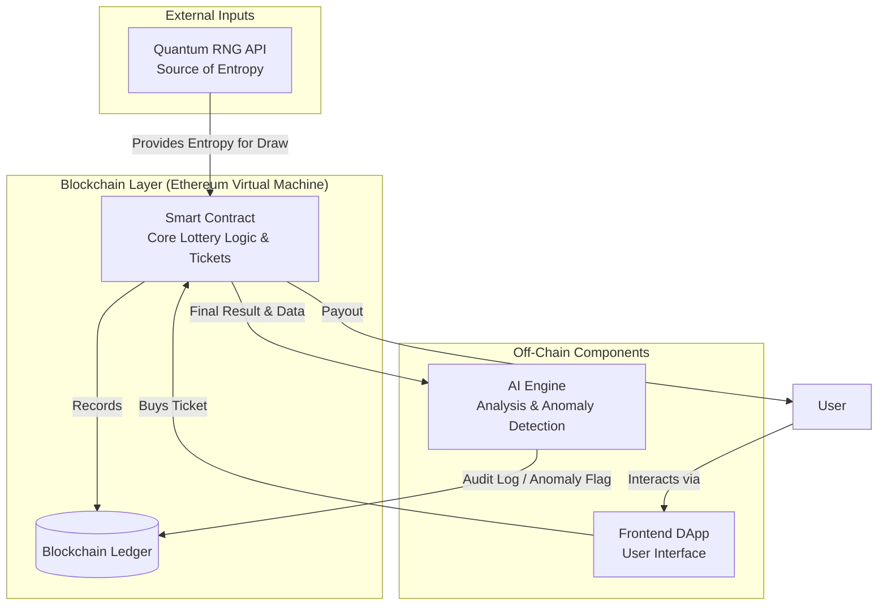

# Quantum Lottery System 🔗🎲⚛️

[](https://opensource.org/licenses/Apache-2.0)

A revolutionary, provably-fair lottery system powered by Quantum Entanglement principles and Blockchain technology. This project aims to create a new standard for transparency and trust in digital lotteries by leveraging verifiable quantum randomness and decentralized smart contract execution.

## 🌟 Features

*   **Provably Fair:** Leveraging quantum randomness (QRNG) for truly unpredictable and verifiable results, moving beyond traditional pseudo-random number generators (PRNGs).
*   **Fully Transparent:** Every ticket purchase, draw execution, and prize distribution is immutably recorded on the blockchain for public audit and verification.
*   **Decentralized Trust:** Operates via immutable smart contracts, eliminating central points of failure, control, and manipulation.
*   **AI-Powered Analysis:** Utilizes machine learning for real-time draw analysis, anomaly detection, and monitoring for suspicious patterns.

## 🏗️ System Architecture (High-Level Overview)



## ⚙️ Installation & Local Development

### Prerequisites
- [Node.js](https://nodejs.org/) (v18 or higher)
- [npm](https://www.npmjs.com/) or [yarn](https://yarnpkg.com/) package manager
- [Python](https://www.python.org/downloads/) (v3.10 or higher) [Optional: for AI components]
- [Hardhat](https://hardhat.org/) (will be installed locally)

### Getting Started
1.  **Clone the repository:**
    ```bash
    git clone https://github.com/BlockchainLotteryAI/Quantum-Lottery-System.git
    cd Quantum-Lottery-System
    ```

2.  **Install JavaScript dependencies:**
    ```bash
    npm install
    ```

3.  **Set up environment configuration:**
    ```bash
    cp .env.example .env
    ```
    Edit the `.env` file with your own values (e.g., `ALCHEMY_API_KEY`, `PRIVATE_KEY` for testnet deployment).

4.  **Compile the smart contracts:**
    ```bash
    npx hardhat compile
    ```

5.  **Run tests:**
    ```bash
    npx hardhat test
    ```

## 🧪 Usage

### Running a Local Node
To deploy and test the contracts on a local Hardhat network:
```bash
npx hardhat node
```

### Deploying to a Testnet
To deploy the contract to a testnet (e.g., Sepolia), configure your `.env` file and run:
```bash
npx hardhat run scripts/deploy.js --network sepolia
```

### Interacting via the Console
Spawn a Hardhat console connected to a network to interact with the deployed contract:
```bash
npx hardhat console --network localhost
```

## 🛣️ Project Roadmap

- [ ] **Phase 1: Quantum RNG Integration MVP** - Integrate with a quantum entropy source API (e.g., ANU QRNG) for off-chain testing. (Target: Q4 2024)
- [ ] **Phase 2: Core Smart Contract Development** - Write, test, and initially audit the core lottery logic (Ticket sales, draw execution, prize distribution). (Target: Q1 2025)
- [ ] **Phase 3: AI Module & Testnet Launch** - Develop AI monitoring scripts and deploy the full system to a public testnet. (Target: Q2 2025)
- [ ] **Phase 4: Mainnet Launch & Security Audit** - Commission a full security audit from a reputable firm and deploy on mainnet. (Target: Q3 2025)

## 🤝 Contributing

We enthusiastically welcome contributions from the community. Please read our [Contributing Guidelines](CONTRIBUTING.md) for details on our development process, how to propose bugfixes and improvements, and how to build and test your changes.

## 🛡️ Security

The security of our system is paramount. Please review our [Security Policy](SECURITY.md) for instructions on how to responsibly report any security vulnerabilities you discover. We are committed to working with security researchers to ensure the safety and integrity of the Quantum Lottery System.

## 📜 License

This project is licensed under the Apache License 2.0. See the [LICENSE](LICENSE) file for full details. This permissive license allows for commercial use, distribution, modification, and private use, with minimal restrictions.

## ❓ Frequently Asked Questions

**Q: How is the randomness in this system truly different?**
A: Traditional systems use pseudo-random number generators (PRNGs) which are deterministic algorithms. Our system integrates verifiable quantum entropy sources, where the randomness is derived from fundamental physical processes (e.g., photon behavior) that are inherently unpredictable.

**Q: Is the AI component a central point of control?**
A: No. The AI is an off-chain monitoring and analysis tool. It cannot stop or alter a draw. Its primary purpose is to provide additional transparency and alerting. The core draw mechanism and prize distribution remain entirely on-chain and governed by the immutable smart contract logic.

**Q: What blockchain will this be deployed on?**
A: The initial development and testing are targeting the Ethereum Virtual Machine (EVM) ecosystem, allowing for potential deployment on Ethereum Mainnet, Layer 2s (Arbitrum, Optimism), or other EVM-compatible chains for scalability.
